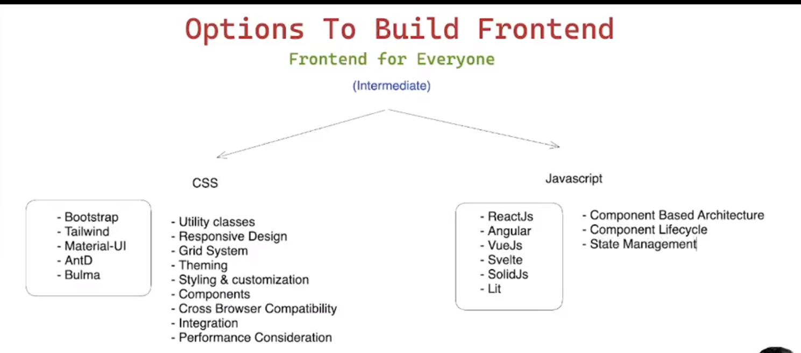
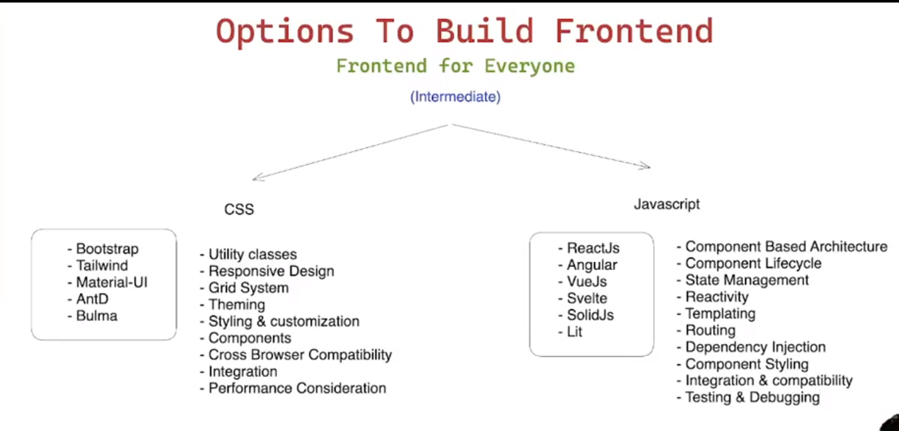
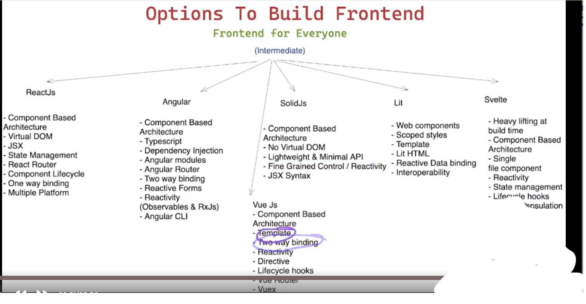
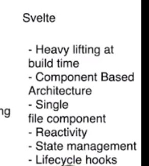
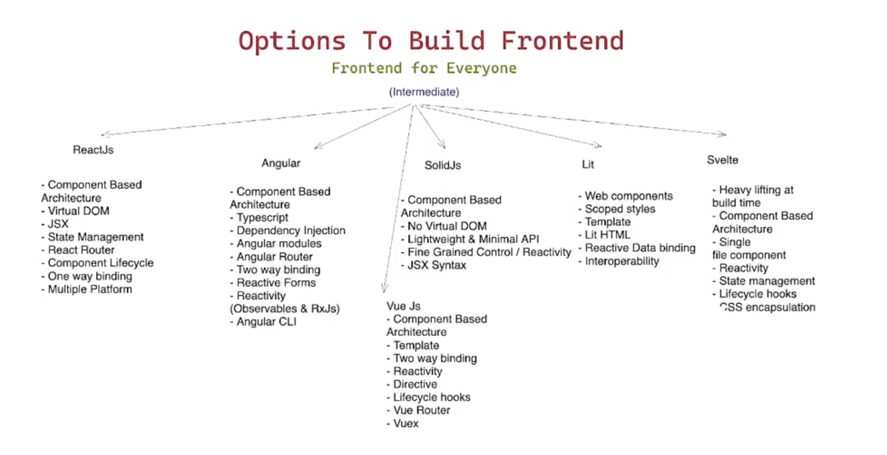

# Frontend For EveryOne

1. 

**How to compare the different frameworks and library**

```
https://npmtrends.com/@angular-devkit/core-vs-antd-vs-bootstrap-vs-bulma-vs-material-ui-vs-react-vs-tailwindcss-vs-vue

```







```
LifeCycle hooks
CSS Encapsulation

```


